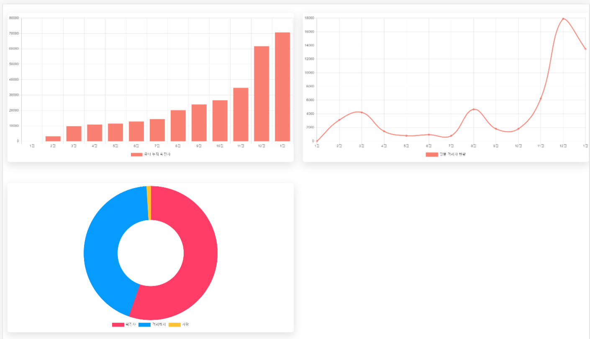

# 1. axios

>`npm install axios`

``` js
import axios from 'axios'


    //  GET 요청 
   const axiosEvents = async () => {
            const res = await axios.get("https://api.covid19api.com/total/dayone/country/kr")
            makeData(res.data) 
        }
```
___

# 2. reduce

>배열.reduce((쌓여서 다음 반복문으로 넘어가는 전달값(누적값),  현재 반복문이 돌고 있는 값(현재값)) => { return 결과 }, 초깃값);

``` js 
const arr = items.reduce((acc, cur)=>{ },[]); 
```

___
 
# 3. chart.js ( react-chartjs-2 )
>npm install react-chartjs-2 chart.js
```js
import { Bar, Doughnut, Line } from 'react-chartjs-2'
```


